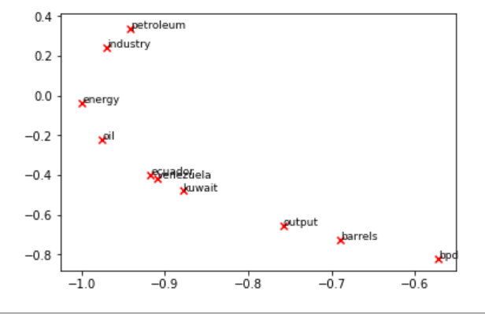
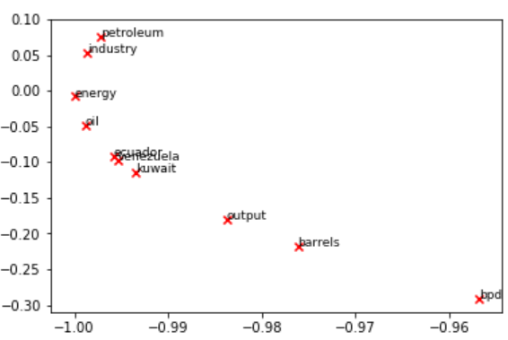
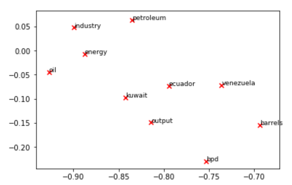
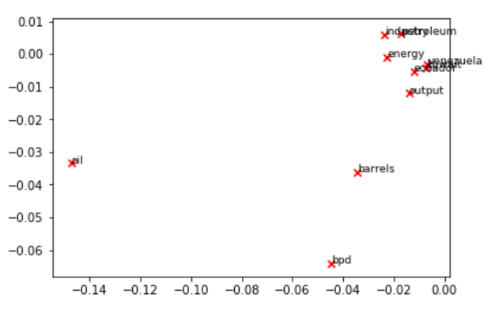
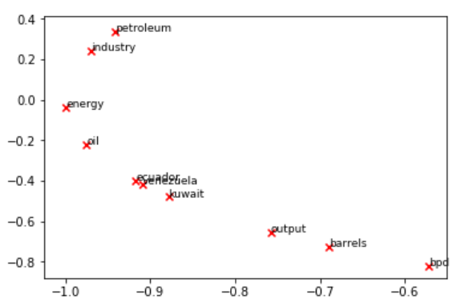

# Word2Vector

## OverView
This code use Word2Vector to map english words to vector space.

## Results
                                                          SVD U k=2

                                                          SVD US k=2

                                                        SVD US k=2000

                                                         SVD U k=2000

                                                         TrunSVD k=2

